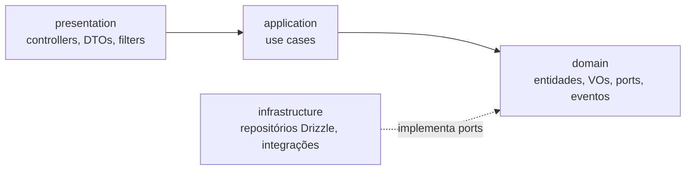
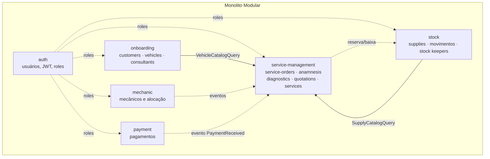
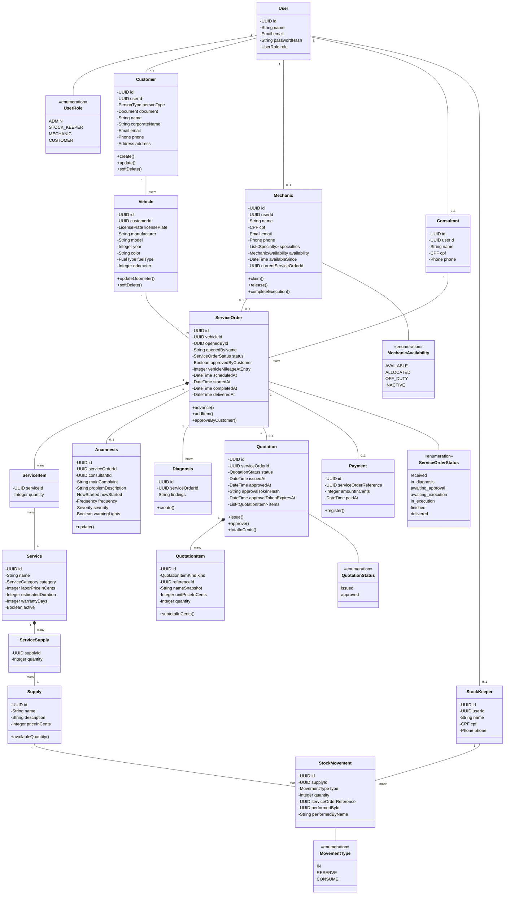

# 🔧 Oficina Mecânica API

<div align="center">

[](https://sonarcloud.io/summary/new_code?id=10Org-17SOAT_tech-challenge-17soat)
[](https://sonarcloud.io/summary/new_code?id=10Org-17SOAT_tech-challenge-17soat)
[](https://sonarcloud.io/summary/new_code?id=10Org-17SOAT_tech-challenge-17soat)
[](https://sonarcloud.io/summary/new_code?id=10Org-17SOAT_tech-challenge-17soat)
[](https://sonarcloud.io/summary/new_code?id=10Org-17SOAT_tech-challenge-17soat)
[](https://sonarcloud.io/summary/new_code?id=10Org-17SOAT_tech-challenge-17soat)
[](https://sonarcloud.io/summary/new_code?id=10Org-17SOAT_tech-challenge-17soat)

</div>

API de gestão de ordens de serviço para uma oficina mecânica de veículos, desenvolvida como parte do curso de Arquitetura de Software da FIAP (Tech Challenge — SOAT 17).

<div align="center">
  <a href="#visao-geral">Visão Geral</a> •
  <a href="#arquitetura">Arquitetura</a> •
  <a href="#tecnologias">Tecnologias</a> •
  <a href="#diagramas">Diagramas</a> •
  <a href="#instalacao-e-uso">Instalação e Uso</a> • <br/>
  <a href="#fluxo-de-teste">Testando o ciclo de vida da OS</a> •
  <a href="#estrutura-do-projeto">Estrutura do Projeto</a> •
  <a href="#apis">APIs</a> •
  <a href="#banco-de-dados">Banco de Dados</a> •
  <a href="#adrs">ADRs</a> •
  <a href="#resolucao-de-problemas">Resolução de Problemas</a> •
  <a href="#licenca">Licença</a>
</div>

<h2 id="visao-geral">📋 Visão Geral</h2>

O sistema digitaliza o fluxo completo de atendimento de uma oficina mecânica: da recepção do veículo até a entrega, passando por anamnese, diagnóstico, orçamento aprovado pelo cliente, execução pelo mecânico e pagamento.

Hoje a oficina trabalha com controles manuais e planilhas, o que gera perda de histórico, orçamentos sem rastreabilidade e estoque de peças inconsistente. A API substitui esse processo por um fluxo com estados explícitos, valores congelados no orçamento e um livro-razão de estoque auditável.

### Principais recursos

- **Cadastro de clientes e veículos**: pessoa física ou jurídica, com placa, modelo, quilometragem e histórico
- **Ordem de serviço com ciclo de vida explícito**: `received → in_diagnosis → awaiting_approval → awaiting_execution → in_execution → finished → delivered`
- **Anamnese**: registro estruturado do relato do cliente no momento da recepção
- **Diagnóstico**: laudo do mecânico que dá origem ao orçamento
- **Orçamento com aprovação do cliente**: enviado por e-mail com link de aprovação de uso único e prazo de expiração
- **Alocação de mecânicos em FIFO**: o mecânico disponível há mais tempo assume a próxima ordem
- **Controle de estoque por livro-razão**: entrada, reserva e baixa de insumos — a quantidade nunca é uma coluna, é sempre derivada dos movimentos
- **Pagamento**: registra o pagamento da ordem e, por evento de domínio, marca o veículo como entregue
- **Autenticação JWT com papéis**: `ADMIN`, `STOCK_KEEPER`, `MECHANIC` e `CUSTOMER`
- **Relatório de tempo médio de execução** das ordens concluídas

<h2 id="arquitetura">🏗️ Arquitetura</h2>

<details>
<summary>Expandir para mais detalhes</summary>

O projeto é um **Monolito Modular** em NestJS, com as regras de dependência da **Clean Architecture** e modelagem orientada a **Domain-Driven Design (DDD)**.

### Regra de dependência (Clean Architecture)

Dentro de cada módulo, as camadas obedecem a uma única direção:



- `domain` nunca importa de `application`, `infrastructure` ou `presentation`
- `infrastructure` implementa as portas declaradas em `domain` (ex.: `SupplyRepository`), nunca o contrário
- A injeção de dependência sempre usa tokens (`@Inject(SUPPLY_REPOSITORY)`), nunca classes concretas de infraestrutura

### Monolito Modular

Cada módulo é um contexto delimitado com seu próprio domínio, casos de uso, persistência e API. A comunicação entre módulos acontece **apenas** através da pasta `public/` — o contrato publicado — ou por **eventos de domínio**.



Regras de fronteira que valem para todos os módulos:

- **Sem FK entre contextos**: uma referência a linha de outro módulo (`service_order_reference`, `supply_id` em `service_supplies`, `user_id` nos perfis) é validada no domínio, não pelo banco
- **Snapshots em vez de FK** quando o histórico precisa continuar verdadeiro: `opened_by_name` na ordem, `performed_by_name` no livro-razão, `name_snapshot`/`unit_price_in_cents` nos itens do orçamento
- Cada módulo tem **um único `ExceptionFilter`** traduzindo erros de domínio para HTTP

### Eventos de Domínio

Publicados via `@nestjs/event-emitter` sobre a porta `DomainEventPublisher`:

| Evento | Publicado por | Efeito |
|--------|---------------|--------|
| `mechanic.allocated` | mechanic | mecânico assume a ordem (FIFO) |
| `mechanic.released` | mechanic | mecânico volta à fila de disponíveis |
| `execution.started` | mechanic | ordem vai para `in_execution` |
| `execution.completed` | mechanic | ordem vai para `finished` |
| `payment.received` | payment | ordem vai para `delivered` e carimba `delivered_at` |
| `part.reserved.for-service-order` | stock | reserva de insumo para a ordem |
| `part.written-off-from-stock` | stock | baixa definitiva do insumo |
| `purchase.request.needed` | stock | sinaliza necessidade de reposição |

</details>

<h2 id="tecnologias">🔧 Tecnologias</h2>

<details>
<summary>Expandir para mais detalhes</summary>

### Backend

- **Node.js 20+** e **TypeScript 5.7**
- **NestJS 11**: framework base
- **Zod 4 + nestjs-zod**: validação de contratos e DTOs
- **Passport + JWT (`@nestjs/jwt`)**: autenticação e autorização por papéis
- **bcryptjs**: hash de senhas
- **`@nestjs/event-emitter`**: eventos de domínio entre módulos

### Banco de Dados

- **PostgreSQL 16**
- **Drizzle ORM + drizzle-kit**: schema tipado e migrações append-only

### Infraestrutura & Qualidade

- **Docker / Docker Compose**: banco de dados local
- **Jest + Supertest**: testes unitários e end-to-end
- **ESLint + Prettier**: padronização de código
- **SonarCloud**: análise estática e cobertura (GitHub Actions)
- **Swagger/OpenAPI + Scalar**: documentação interativa da API

### Integração

- **Brevo**: envio dos e-mails de aprovação de orçamento (driver `log` em desenvolvimento)

</details>

<h2 id="diagramas">📊 Diagramas</h2>

<details>
<summary>Expandir para mais detalhes</summary>

### Modelo de Domínio



> As associações que cruzam contextos (`User → Customer/Mechanic/Consultant/StockKeeper`, `Mechanic → ServiceOrder`, `Payment → ServiceOrder`, `ServiceSupply → Supply`) existem no modelo conceitual, mas **não** viram foreign key no banco — são validadas no domínio.

### Event Storming

Quadro completo no Miro: <https://miro.com/app/board/uXjVH7iT7WY=/>

</details>

<h2 id="instalacao-e-uso">🚀 Instalação e Uso</h2>

<details>
<summary>Expandir para mais detalhes</summary>

### Requisitos

- Docker e Docker Compose — suficientes para subir tudo
- Node.js 20+ e npm 10+ — apenas para desenvolvimento local

### Subindo com Docker (recomendado)

Um comando levanta a API e o banco, aplica as migrações e carrega os dados de
demonstração:

```bash
git clone git@github.com:10Org-17SOAT/tech-challenge-17soat.git
cd tech-challenge-17soat

docker compose up -d --build
```

Não é preciso criar `.env` nem instalar dependências. Na primeira subida a API
espera o PostgreSQL ficar saudável, aplica as 25 migrações e roda o seed —
acompanhe por `docker compose logs -f api`.

Quando aparecer `Nest application successfully started`, a aplicação está em:

- **Scalar (documentação interativa):** <http://localhost:3000/reference>
- **Swagger:** <http://localhost:3000/docs>

**Contas criadas pelo seed** — senha `Oficina@2026` para todas:

| Conta | Papel |
| --- | --- |
| `admin@oficina.dev` | ADMIN |
| `consultor@oficina.dev` | ADMIN |
| `bruno@oficina.dev` | MECHANIC |
| `diego@oficina.dev` | MECHANIC |
| `estoquista@oficina.dev` | STOCK_KEEPER |
| `ana@example.com` | CUSTOMER |

Junto vêm dois clientes, três veículos, cinco serviços com ficha técnica e cinco
insumos com saldo em estoque. O seed é idempotente: rodar de novo não duplica nada.

Para parar, `docker compose down`. Para recomeçar do zero (apagando o banco),
`docker compose down -v`.

> **Notas.** O `docker-compose.yml` é um ambiente de demonstração: ele define
> `NODE_ENV=development` e `RUN_SEED=true`, porque o seed se recusa a rodar em
> produção. Um deploy real usa a imagem sem essas duas variáveis, e aí o
> `NODE_ENV=production` do `Dockerfile` prevalece e nenhum dado de exemplo é
> criado. O envio de e-mail vem como `MAIL_DRIVER=log`, que apenas escreve a
> mensagem no log — nada é enviado de fato. Se existir um `.env` na raiz, o
> Docker Compose usa os valores dele no lugar dos padrões acima.

### Desenvolvimento local

```bash
# Clone o repositório
git clone git@github.com:10Org-17SOAT/tech-challenge-17soat.git
cd tech-challenge-17soat

# Instale as dependências
npm install

# Configure as variáveis de ambiente
cp .env.example .env
# gere um segredo real para o JWT:
openssl rand -base64 32   # cole o resultado em JWT_SECRET
# opcional: preencha BOOTSTRAP_ADMIN_EMAIL e BOOTSTRAP_ADMIN_PASSWORD
# para que o primeiro administrador seja criado no boot

# Suba apenas o PostgreSQL (o serviço `api` fica de fora aqui)
docker compose up -d postgres

# Aplique as migrações
npm run db:migrate

# Popule o banco com contas, catálogo e estoque de demonstração
npm run db:seed

# Suba a aplicação em modo watch
npm run start:dev
```

### Scripts disponíveis

| Script | Descrição |
|--------|-----------|
| `npm run start:dev` | Sobe a API em modo watch |
| `npm run start:prod` | Executa o build gerado em `dist/` |
| `npm run build` | Compila o projeto |
| `npm run lint` | ESLint com `--fix` |
| `npm run format` | Prettier em `src/` e `test/` |
| `npm test` | Testes unitários |
| `npm run test:cov` | Testes unitários com cobertura |
| `npm run test:e2e` | Testes end-to-end (requer o banco no ar) |
| `npm run db:generate` | Gera uma nova migração a partir do schema |
| `npm run db:migrate` | Aplica as migrações pendentes |
| `npm run db:seed` | Popula o banco com dados de demonstração (idempotente) |
| `npm run db:studio` | Abre o Drizzle Studio |

### Acessando a aplicação

- **API**: <http://localhost:3000>
- **Swagger UI**: <http://localhost:3000/docs>
- **Scalar API Reference**: <http://localhost:3000/reference>

### Autenticando

Todas as rotas exigem JWT, exceto `POST /auth/login` e o link público de aprovação de orçamento.

```bash
# 1. Faça login com o admin do seed (ou com o criado no bootstrap)
curl -X POST http://localhost:3000/auth/login \
  -H 'Content-Type: application/json' \
  -d '{"email":"admin@oficina.dev","password":"Oficina@2026"}'

# 2. Use o token retornado nas demais chamadas
curl http://localhost:3000/service-orders \
  -H 'Authorization: Bearer <token>'
```

### Variáveis de ambiente

| Variável | Descrição | Padrão |
|----------|-----------|--------|
| `DB_HOST` / `DB_PORT` / `DB_USER` / `DB_PASSWORD` / `DB_NAME` | Conexão com o PostgreSQL | `localhost` / `5432` / `postgres` / `postgres` / `tech_challenge` |
| `JWT_SECRET` | Segredo de assinatura do JWT (mín. 32 caracteres) | — (obrigatório) |
| `JWT_EXPIRES_IN` | Validade do token | `1h` |
| `BOOTSTRAP_ADMIN_EMAIL` / `BOOTSTRAP_ADMIN_PASSWORD` | Cria o primeiro administrador no boot (obrigatórios em conjunto) | vazio |
| `APP_BASE_URL` | Base pública usada no link de aprovação do orçamento | `http://localhost:3000` |
| `MAIL_DRIVER` | `log` (apenas registra no logger) ou `brevo` | `log` |
| `MAIL_FROM` / `MAIL_FROM_NAME` | Remetente dos e-mails | — |
| `BREVO_API_KEY` | Chave da Brevo, obrigatória quando `MAIL_DRIVER=brevo` | — |

</details>

<h2 id="fluxo-de-teste">🧪 Testando o ciclo de vida da OS</h2>

<details>
<summary>Expandir para mais detalhes</summary>

Um roteiro do balcão à entrega, levando uma ordem de serviço pelos sete estados
com os dados que o seed já deixou no banco.

### 1. Popule o banco

```bash
npm run db:seed
```

O seed cadastra as contas, os perfis, o catálogo de serviços e o estoque — mas
**não** abre nenhuma OS: abrir, diagnosticar, orçar, executar e pagar é
justamente o que este guia percorre. Os ids são fixos, então os comandos abaixo
podem ser colados como estão. Rodar de novo não duplica nem apaga nada; para
recomeçar do zero, veja [Recomeçar o banco](#resolucao-de-problemas).

**Contas** — senha `Oficina@2026` para todas:

| E-mail | Papel | Usada para |
|--------|-------|------------|
| `admin@oficina.dev` | `ADMIN` | quase tudo neste roteiro |
| `consultor@oficina.dev` | `ADMIN` | recepção (o perfil é que a marca como consultora) |
| `bruno@oficina.dev` | `MECHANIC` | diagnóstico e execução |
| `diego@oficina.dev` | `MECHANIC` | segundo da fila FIFO |
| `estoquista@oficina.dev` | `STOCK_KEEPER` | entradas de estoque |
| `ana@example.com` | `CUSTOMER` | consultar o status da própria OS |

**Ids usados no roteiro:**

| O quê | Id |
|-------|-----|
| Veículo — Fiat Uno `ABC-1234` (da Ana) | `33333333-3333-4333-8333-000000000001` |
| Consultora Carla Menezes | `44444444-4444-4444-8444-000000000001` |
| Serviço — Troca de pastilhas (R$ 150,00) | `88888888-8888-4888-8888-000000000002` |
| Insumo — Pastilha de freio (R$ 120,00, 20 em estoque) | `77777777-7777-4777-8777-000000000001` |

O seed imprime a lista completa — inclusive o segundo carro da Ana, o cliente PJ
e os demais serviços — ao terminar.

### 2. Prepare o terminal

```bash
API=http://localhost:3000

# Extrai um campo do JSON da resposta sem depender do jq
field() { node -e "let s='';process.stdin.on('data',d=>s+=d).on('end',()=>console.log(process.argv[1].split('.').reduce((a,k)=>a?.[k],JSON.parse(s))))" "$1"; }

login() { curl -s -X POST $API/auth/login -H 'Content-Type: application/json' \
  -d "{\"email\":\"$1\",\"password\":\"Oficina@2026\"}" | field access_token; }

ADMIN=$(login admin@oficina.dev)
BRUNO=$(login bruno@oficina.dev)
```

Prefere clicar? O mesmo roteiro funciona pelo <http://localhost:3000/docs>:
autentique com o token do `POST /auth/login` no botão **Authorize**.

### 3. Recepção — abre a OS em `received`

A anamnese é o ponto de entrada: registrar o relato do cliente é o que abre a
ordem de serviço.

```bash
OS=$(curl -s -X POST $API/service-order/anamnesis \
  -H "Authorization: Bearer $ADMIN" -H 'Content-Type: application/json' \
  -d '{
    "vehicleId": "33333333-3333-4333-8333-000000000001",
    "consultantId": "44444444-4444-4444-8444-000000000001",
    "mainComplaint": "Barulho ao frear",
    "problemDescription": "Chiado agudo nas rodas dianteiras",
    "severity": "moderate",
    "frequency": "constant"
  }' | field serviceOrderId)

curl -s $API/service-orders/$OS/status -H "Authorization: Bearer $ADMIN"
# {"status":"received"}
```

### 4. Diagnóstico — `in_diagnosis` e depois `awaiting_approval`

```bash
curl -s -X POST $API/service-orders/$OS/diagnosis/start \
  -H "Authorization: Bearer $BRUNO" > /dev/null
# status: in_diagnosis

QUOTE=$(curl -s -X POST $API/service-orders/$OS/diagnosis \
  -H "Authorization: Bearer $BRUNO" -H 'Content-Type: application/json' \
  -d '{
    "findings": "Pastilhas dianteiras no limite",
    "serviceItems": [{ "serviceId": "88888888-8888-4888-8888-000000000002", "quantity": 1 }]
  }' | field quotation.id)
```

Registrar o laudo emite o orçamento e dispara o e-mail de aprovação na mesma
tacada. O orçamento sai com **duas linhas**, embora só um serviço tenha sido
pedido:

```json
{ "kind": "labor", "name": "Troca de pastilhas de freio", "quantity": 1, "unitPriceInCents": 15000 }
{ "kind": "part",  "name": "Pastilha de freio dianteira", "quantity": 1, "unitPriceInCents": 12000 }
```

A peça entrou pela ficha técnica do serviço — não existe linha de peça avulsa. O
total é R$ 270,00.

### 5. Aprovação do cliente — `awaiting_execution`

Com `MAIL_DRIVER=log` (o padrão), o e-mail não sai: a mensagem com o link de
aprovação é escrita no log da aplicação. Você pode abrir aquele link ou aprovar
direto:

```bash
curl -s -X POST $API/quotations/$QUOTE/approve -H "Authorization: Bearer $ADMIN" > /dev/null
# status: awaiting_execution
```

### 6. Estoque — reserva a peça

A reserva é um passo explícito, não uma consequência automática da aprovação:

```bash
curl -s -X POST $API/supplies/77777777-7777-4777-8777-000000000001/reservations \
  -H "Authorization: Bearer $ADMIN" -H 'Content-Type: application/json' \
  -d "{\"quantity\":1,\"serviceOrderReference\":\"$OS\"}"
# availableBalance cai de 20 para 19; reservedQuantity: 1
```

### 7. Execução — `in_execution`

Não existe "iniciar trabalho": assumir a ordem **é** o começo da execução.

```bash
MECANICO=$(curl -s -X POST $API/mechanics/claim \
  -H "Authorization: Bearer $BRUNO" -H 'Content-Type: application/json' \
  -d "{\"serviceOrderId\":\"$OS\"}" | field id)

echo $MECANICO   # quem a fila entregou
# status: in_execution
```

> A alocação é FIFO: quem está disponível há mais tempo assume, **não**
> necessariamente quem chamou. Na primeira rodada sai o Bruno; na segunda, como
> ele voltou para o fim da fila ao ser liberado, sai o Diego. Por isso o id vem
> da resposta (`$MECANICO`) em vez de ser fixo — é ele que o passo 9 exige.

### 8. Estoque — dá baixa na peça

```bash
curl -s -X POST $API/supplies/77777777-7777-4777-8777-000000000001/write-offs \
  -H "Authorization: Bearer $ADMIN" -H 'Content-Type: application/json' \
  -d "{\"quantity\":1,\"serviceOrderReference\":\"$OS\"}"
# reservedQuantity volta a 0; o saldo disponível segue 19
```

### 9. Conclusão — `finished`

```bash
curl -s -X POST $API/mechanics/$MECANICO/complete-execution \
  -H "Authorization: Bearer $BRUNO" -H 'Content-Type: application/json' \
  -d "{\"serviceOrderId\":\"$OS\"}" > /dev/null
# status: finished — e o mecânico volta para a fila como AVAILABLE
```

Este é o momento de olhar o relatório: ele conta apenas as ordens **em
`finished`**, então uma OS já paga não entra na média.

```bash
curl -s "$API/service-orders/average-execution-time" -H "Authorization: Bearer $ADMIN"
# {"averageExecutionTimeMinutes":0,"sampleSize":1}
```

A média sai em minutos inteiros, então um roteiro percorrido em segundos
arredonda para `0` — o que importa aqui é o `sampleSize` subir para 1 e voltar a
zero no passo seguinte.

### 10. Pagamento — `delivered`

```bash
curl -s -X POST $API/payments \
  -H "Authorization: Bearer $ADMIN" -H 'Content-Type: application/json' \
  -d "{\"serviceOrderId\":\"$OS\"}"
# {"amountInCents":27000, ...}
```

O pagamento é mockado — não há gateway, ele nasce confirmado — e publica
`payment.received`, que carimba a entrega:

```bash
curl -s $API/service-orders/$OS -H "Authorization: Bearer $ADMIN"
# status: delivered, deliveredAt preenchido, openedByName: "Carla Menezes"
```

### 11. A visão do cliente

O único endpoint que um `CUSTOMER` alcança, e apenas para as ordens dos próprios
veículos:

```bash
ANA=$(login ana@example.com)
curl -s $API/service-orders/$OS/status -H "Authorization: Bearer $ANA"
# {"status":"delivered"}
```

Uma ordem de outro cliente responde **404**, não 403: um 403 confirmaria quais
ids existem e deixaria mapear as ordens da oficina por tentativa.

### O que vale observar no caminho

- **O snapshot é imutável**: renomeie a consultora Carla e o `openedByName` da OS
  continua o nome antigo — o histórico não muda quando a origem muda
- **O preço congela na emissão**: altere o `laborPriceInCents` do serviço depois
  do orçamento emitido e o `unitPriceInCents` do item não acompanha
- **O saldo é derivado**: `GET /supplies/{id}/stock` soma o livro-razão; não
  existe coluna de quantidade para conferir
- **Fora de ordem dá 409**: tente pagar uma OS que não está em `finished`, ou
  iniciar o diagnóstico de uma que já saiu de `received`

</details>

<h2 id="estrutura-do-projeto">📁 Estrutura do Projeto</h2>

<details>
<summary>Expandir para mais detalhes</summary>

```
tech-challenge-17soat/
│
├── src/
│   ├── main.ts                                # Bootstrap da aplicação
│   ├── app.module.ts                          # Módulo raiz
│   │
│   ├── modules/
│   │   ├── auth/                              # Usuários, JWT, roles e guards
│   │   ├── onboarding/
│   │   │   ├── customer/                      # Clientes (PF e PJ)
│   │   │   ├── vehicles/                      # Veículos
│   │   │   └── consultant/                    # Consultores de atendimento
│   │   ├── service-management/
│   │   │   ├── service-orders/                # Ordem de serviço (agregado central)
│   │   │   ├── anamnesis/                     # Anamnese
│   │   │   ├── diagnostics/                   # Diagnóstico
│   │   │   ├── quotations/                    # Orçamento e aprovação
│   │   │   └── services/                      # Catálogo de serviços
│   │   ├── mechanic/                          # Mecânicos e alocação FIFO
│   │   ├── stock/                             # Insumos, livro-razão e estoquistas
│   │   └── payment/                           # Pagamentos
│   │
│   └── shared/
│       ├── config/
│       │   ├── database/                      # Conexão, schema agregado e migrações
│       │   ├── env/                           # Schema Zod das variáveis de ambiente
│       │   └── swagger/                       # Swagger + Scalar
│       ├── domain/                            # Ports, value objects e eventos comuns
│       └── infrastructure/                    # Publisher de eventos
│
├── test/                                      # Testes end-to-end
├── scripts/
│   └── seed.ts                                # Dados de demonstração (npm run db:seed)
├── docs/
│   ├── adr/                                   # Architecture Decision Records
│   ├── security/                              # Relatório SonarCloud
│   └── product/                               # Documentação de produto
├── docker-compose.yml                         # PostgreSQL local
├── drizzle.config.ts                          # Configuração do drizzle-kit
├── GUIDELINES.md                              # Convenções do projeto
└── README.md                                  # Este arquivo
```

### Organização interna de um módulo

```
módulo/
├── domain/                                  # Núcleo, sem dependências externas
│   ├── <entidade>.entity.ts                 # Entidade com factory estática
│   ├── <entidade>.repository.ts             # Porta (interface + token de DI)
│   ├── value-objects/                       # Objetos de valor imutáveis
│   ├── errors/                              # Erros de domínio (<X>Error)
│   └── events/                              # Eventos de domínio
├── application/                             # Casos de uso
│   ├── <verbo-substantivo>.usecase.ts
│   └── event-handlers/                      # Reações a eventos de outros módulos
├── infrastructure/
│   └── persistence/
│       ├── schema.ts                        # Tabelas Drizzle do módulo
│       └── drizzle-<entidade>.repository.ts # Implementação da porta
├── presentation/
│   ├── <recurso>.controller.ts
│   ├── dto/                                 # Schemas Zod de entrada e saída
│   └── <modulo>-errors.filter.ts            # Único tradutor de erro → HTTP
└── public/                                  # Contrato publicado a outros módulos
```

</details>

<h2 id="apis">🌐 APIs</h2>

<details>
<summary>Expandir para mais detalhes</summary>

Todas as rotas exigem `Authorization: Bearer <token>`, exceto onde indicado como pública. O papel exigido está marcado em cada bloco.

#### Autenticação

```
POST /auth/login                                     # Público — retorna o JWT
GET  /auth/me                                        # Qualquer usuário autenticado
```

#### Usuários — `ADMIN`

```
POST   /user                                         # Criar usuário
GET    /user                                         # Listar usuários
GET    /user/{user_id}                               # Obter usuário
PATCH  /user/{user_id}                               # Atualizar usuário
DELETE /user/{user_id}                               # Remover usuário
```

#### Clientes, veículos e consultores — `ADMIN`

```
POST   /customers                                    # Cadastrar cliente (PF ou PJ)
GET    /customers                                    # Listar clientes
GET    /customers/{id}                               # Obter cliente
PATCH  /customers/{id}                               # Atualizar cliente
DELETE /customers/{id}                               # Remover cliente (soft delete)

POST   /vehicles                                     # Cadastrar veículo
GET    /vehicles                                     # Listar veículos
GET    /vehicles/{vehicleId}                         # Obter veículo
PATCH  /vehicles/{vehicleId}                         # Atualizar veículo
DELETE /vehicles/{vehicleId}                         # Remover veículo (soft delete)

POST   /consultants                                  # Cadastrar consultor
GET    /consultants                                  # Listar consultores
GET    /consultants/{id}                             # Obter consultor
PATCH  /consultants/{id}                             # Atualizar consultor
DELETE /consultants/{id}                             # Remover consultor (soft delete)
```

#### Catálogo de serviços — `ADMIN`

```
GET    /services                                     # Listar serviços
POST   /services                                     # Criar serviço
GET    /services/{id}                                # Obter serviço
PATCH  /services/{id}                                # Atualizar serviço
DELETE /services/{id}                                # Remover serviço (soft delete)
GET    /services/{id}/supplies                       # Ficha técnica (insumos do serviço)
PUT    /services/{id}/supplies                       # Substituir a ficha técnica
```

#### Ordens de serviço — `ADMIN`

```
GET    /service-orders                               # Listar ordens
GET    /service-orders/average-execution-time        # Tempo médio de execução
GET    /service-orders/{id}                          # Obter ordem
GET    /service-orders/{id}/status                   # Status da ordem — ADMIN ou CUSTOMER
PATCH  /service-orders/{id}                          # Atualizar / avançar a ordem
DELETE /service-orders/{id}                          # Remover ordem (soft delete)
```

#### Anamnese — `ADMIN`

```
POST   /service-order/anamnesis                      # Registrar anamnese
GET    /service-orders/{serviceOrderId}/anamnesis    # Obter anamnese
PATCH  /service-orders/{serviceOrderId}/anamnesis    # Atualizar anamnese
DELETE /service-orders/{serviceOrderId}/anamnesis    # Remover anamnese
```

#### Diagnóstico — `ADMIN`, `MECHANIC`

```
POST   /service-orders/{serviceOrderId}/diagnosis/start   # Iniciar diagnóstico
POST   /service-orders/{serviceOrderId}/diagnosis         # Registrar laudo (emite o orçamento)
```

#### Orçamentos

```
GET    /service-orders/{serviceOrderId}/quotation    # ADMIN — orçamento da ordem
GET    /quotations/{id}                              # ADMIN — obter orçamento
POST   /quotations/{id}/send-approval-email          # ADMIN — (re)enviar e-mail de aprovação
POST   /quotations/{id}/approve                      # ADMIN — aprovar manualmente
GET    /quotations/approve?token=...                 # Público — aprovação pelo link do e-mail
```

#### Mecânicos — `ADMIN`, `MECHANIC`

```
POST   /mechanics                                    # Cadastrar mecânico
GET    /mechanics                                    # Listar mecânicos
GET    /mechanics/{id}                               # Obter mecânico
PATCH  /mechanics/{id}                               # Atualizar mecânico
DELETE /mechanics/{id}                               # Remover mecânico (soft delete)
POST   /mechanics/claim                              # Assumir a próxima ordem (FIFO)
POST   /mechanics/{id}/release                       # ADMIN — liberar o mecânico
POST   /mechanics/{id}/complete-execution            # Concluir a execução
```

#### Estoque — `ADMIN`, `STOCK_KEEPER`

```
GET    /supplies                                     # Listar insumos
POST   /supplies                                     # Cadastrar insumo
GET    /supplies/{id}                                # Obter insumo
GET    /supplies/{id}/stock                          # Quantidade disponível (derivada do razão)
PATCH  /supplies/{id}                                # Atualizar insumo
DELETE /supplies/{id}                                # Remover insumo (soft delete)
POST   /supplies/{id}/stock-entries                  # Registrar entrada (IN)
POST   /supplies/{id}/reservations                   # Reservar para uma ordem (RESERVE)
POST   /supplies/{id}/write-offs                     # Dar baixa (CONSUME)

GET    /stock-keepers                                # Listar estoquistas
POST   /stock-keepers                                # Cadastrar estoquista
GET    /stock-keepers/{id}                           # Obter estoquista
PATCH  /stock-keepers/{id}                           # Atualizar estoquista
DELETE /stock-keepers/{id}                           # Remover estoquista (soft delete)
```

#### Pagamentos — `ADMIN`

```
POST   /payments                                     # Registrar pagamento de uma ordem
GET    /payments/{id}                                # Obter pagamento
```

Documentação completa e interativa em <http://localhost:3000/docs> (Swagger) ou <http://localhost:3000/reference> (Scalar).

</details>

<h2 id="banco-de-dados">💾 Banco de Dados</h2>

<details>
<summary>Expandir para mais detalhes</summary>

### DER (Diagrama Entidade-Relacionamento)

```mermaid
erDiagram
    CUSTOMERS ||--o{ VEHICLES : owns
    VEHICLES  ||--o{ SERVICE_ORDERS : "is serviced in"
    SERVICE_ORDERS ||--o{ SERVICE_ITEMS : contains
    SERVICES ||--o{ SERVICE_ITEMS : "is scoped by"
    SERVICES ||--o{ SERVICE_SUPPLIES : "consumes"
    SERVICE_ORDERS ||--o| ANAMNESES : has
    SERVICE_ORDERS ||--o{ DIAGNOSTICS : has
    SERVICE_ORDERS ||--o| QUOTATIONS : has
    QUOTATIONS ||--o{ QUOTATION_ITEMS : contains
    SUPPLIES ||--o{ STOCK_MOVEMENTS : "is moved by"

    USERS {
        uuid user_id PK "ID único do usuário"
        varchar name "Nome do usuário"
        varchar email "E-mail de login"
        varchar password_hash "Hash bcrypt da senha"
        integer role_id "1=ADMIN 2=STOCK_KEEPER 3=MECHANIC 4=CUSTOMER"
    }

    CUSTOMERS {
        uuid customer_id PK "ID único do cliente"
        uuid user_id "Conta de acesso do cliente (sem FK, validado no domínio)"
        varchar person_type "NATURAL ou LEGAL"
        varchar document "CPF ou CNPJ, único entre os ativos"
        varchar name "Nome (PF)"
        varchar corporate_name "Razão social (PJ)"
        varchar trade_name "Nome fantasia (PJ)"
        varchar email "E-mail de contato"
        jsonb phone "Telefone (value object)"
        jsonb address "Endereço (value object)"
        timestamp created_at "Auditoria"
        timestamp updated_at "Auditoria"
        timestamp deleted_at "Soft delete"
    }

    VEHICLES {
        uuid vehicle_id PK "ID único do veículo"
        uuid customer_id FK "Dono do veículo"
        varchar license_plate "Placa, única"
        varchar manufacturer "Fabricante"
        varchar model "Modelo"
        integer year "Ano"
        varchar color "Cor"
        varchar fuel_type "GASOLINE, ETHANOL, DIESEL, HYBRID"
        integer odometer "Quilometragem atual"
        text description "Observações"
        timestamp created_at "Auditoria"
        timestamp updated_at "Auditoria"
        timestamp deleted_at "Soft delete"
    }

    CONSULTANTS {
        uuid consultant_id PK "ID único do consultor"
        uuid user_id "Conta de acesso (sem FK)"
        varchar name "Nome"
        varchar cpf "CPF, único entre os ativos"
        varchar phone "Telefone"
        timestamp created_at "Auditoria"
        timestamp updated_at "Auditoria"
        timestamp deleted_at "Soft delete"
    }

    MECHANICS {
        uuid mechanic_id PK "ID único do mecânico"
        uuid user_id "Conta de acesso (sem FK)"
        varchar name "Nome"
        varchar cpf "CPF, único entre os ativos"
        varchar email "E-mail"
        jsonb phone "Telefone (value object)"
        jsonb specialties "Lista de especialidades"
        timestamp hire_date "Data de contratação"
        varchar availability "AVAILABLE, ALLOCATED, OFF_DUTY, INACTIVE"
        timestamp available_since "Base da fila FIFO de alocação"
        varchar current_service_order_id "Ordem que o mecânico está executando"
        timestamp created_at "Auditoria"
        timestamp updated_at "Auditoria"
        timestamp deleted_at "Soft delete"
    }

    STOCK_KEEPERS {
        uuid stock_keeper_id PK "ID único do estoquista"
        uuid user_id "Conta de acesso (sem FK)"
        varchar name "Nome"
        varchar cpf "CPF, único entre os ativos"
        varchar phone "Telefone"
        timestamp created_at "Auditoria"
        timestamp updated_at "Auditoria"
        timestamp deleted_at "Soft delete"
    }

    SERVICE_ORDERS {
        uuid service_order_id PK "ID único da ordem"
        uuid vehicle_id FK "Veículo atendido (o cliente vem dele)"
        uuid opened_by_id "Consultor que abriu (snapshot, sem FK)"
        varchar opened_by_name "Nome do consultor no momento da abertura"
        varchar status "received..delivered"
        boolean approved_by_customer "Cliente aprovou o orçamento"
        text notes "Observações"
        integer vehicle_mileage_at_entry "Quilometragem na entrada"
        timestamp scheduled_at "Agendamento"
        timestamp started_at "Início da execução"
        timestamp completed_at "Fim da execução"
        timestamp delivered_at "Entrega, carimbada pelo pagamento"
        timestamp created_at "Auditoria"
        timestamp updated_at "Auditoria"
        timestamp deleted_at "Soft delete"
    }

    SERVICE_ITEMS {
        uuid service_order_id PK "FK e parte da PK composta"
        uuid service_id PK "FK e parte da PK composta"
        integer quantity "Quantidade, sempre positiva"
    }

    SERVICES {
        uuid service_id PK "ID único do serviço"
        varchar name "Nome, único entre os ativos"
        text description "Descrição"
        varchar category "Categoria do serviço"
        integer labor_price_in_cents "Preço da mão de obra em centavos"
        integer estimated_duration "Duração estimada em minutos"
        integer warranty_days "Garantia em dias"
        boolean active "Serviço ativo"
        timestamp created_at "Auditoria"
        timestamp updated_at "Auditoria"
        timestamp deleted_at "Soft delete"
    }

    SERVICE_SUPPLIES {
        uuid service_id PK "FK e parte da PK composta"
        uuid supply_id PK "Insumo do outro contexto, sem FK"
        integer quantity "Quantidade consumida, sempre positiva"
    }

    ANAMNESES {
        uuid anamnesis_id PK "ID único da anamnese"
        uuid service_order_id FK "Ordem, única (uma anamnese por ordem)"
        uuid consultant_id "Consultor que registrou (sem FK)"
        uuid updated_by "Quem atualizou por último"
        text main_complaint "Queixa principal"
        text problem_description "Descrição do problema"
        text problem_started_at "Quando começou"
        varchar how_started "Como começou"
        varchar frequency "Frequência"
        varchar severity "Gravidade"
        boolean warning_lights "Luzes de advertência acesas"
        text unusual_noises_smells "Ruídos ou cheiros"
        text customer_observations "Observações do cliente"
        timestamp created_at "Auditoria"
        timestamp updated_at "Auditoria"
        timestamp deleted_at "Soft delete"
    }

    DIAGNOSTICS {
        uuid diagnosis_id PK "ID único do diagnóstico"
        uuid service_order_id FK "Ordem diagnosticada"
        text findings "Laudo do mecânico"
        timestamp created_at "Auditoria"
    }

    QUOTATIONS {
        uuid quotation_id PK "ID único do orçamento"
        uuid service_order_id FK "Ordem, única (um orçamento por ordem)"
        varchar status "issued ou approved"
        timestamp issued_at "Emissão"
        timestamp approved_at "Aprovação do cliente"
        varchar approval_token_hash "SHA-256 do token do link, único"
        timestamp approval_token_expires_at "Expiração do token"
        timestamp approval_email_sent_at "Nulo se o e-mail não saiu"
        timestamp created_at "Auditoria"
        timestamp updated_at "Auditoria"
    }

    QUOTATION_ITEMS {
        uuid quotation_item_id PK "ID único do item"
        uuid quotation_id FK "Orçamento (cascade on delete)"
        varchar kind "service ou supply"
        uuid reference_id "Linha de origem no catálogo, sem FK"
        varchar name_snapshot "Nome congelado na emissão"
        integer unit_price_in_cents "Preço unitário congelado, em centavos"
        integer quantity "Quantidade, sempre positiva"
    }

    SUPPLIES {
        uuid supply_id PK "ID único do insumo"
        varchar name "Nome, único entre os ativos"
        text description "Descrição"
        integer price_in_cents "Preço em centavos"
        timestamp created_at "Auditoria"
        timestamp updated_at "Auditoria"
        timestamp deleted_at "Soft delete"
    }

    STOCK_MOVEMENTS {
        uuid movement_id PK "ID único do movimento"
        uuid supply_id FK "Insumo movimentado"
        varchar type "IN, RESERVE ou CONSUME"
        integer quantity "Quantidade, sempre positiva"
        varchar service_order_reference "Ordem que motivou o movimento, sem FK"
        uuid performed_by_id "Estoquista (snapshot, obrigatório em IN)"
        varchar performed_by_name "Nome do estoquista no momento do movimento"
        timestamp created_at "Auditoria"
    }

    PAYMENTS {
        uuid payment_id PK "ID único do pagamento"
        uuid service_order_reference "Ordem paga, única, sem FK"
        integer amount_in_cents "Valor cobrado, snapshot em centavos"
        timestamp paid_at "Data do pagamento"
        timestamp created_at "Auditoria"
        timestamp updated_at "Auditoria"
    }
```



> As tabelas `USERS`, `CONSULTANTS`, `MECHANICS`, `STOCK_KEEPERS`, `PAYMENTS` e as colunas `service_supplies.supply_id` / `quotation_items.reference_id` aparecem sem relacionamento desenhado de propósito: **não existe foreign key entre contextos** neste banco. Essas referências são validadas na camada de domínio — a fronteira do monolito modular vale também para o schema.

### Invariantes garantidas pelo banco

- `stock_movements.quantity > 0`, `type ∈ {IN, RESERVE, CONSUME}` e todo movimento `IN` exige um estoquista
- `payments.service_order_reference` é único: uma ordem nunca é cobrada duas vezes
- `quotations.service_order_id` é único: um orçamento por ordem
- Unicidade "entre os ativos" (índices parciais com `deleted_at IS NULL`) para nome de insumo/serviço, CPF de mecânico/consultor/estoquista e documento do cliente — o soft delete libera o valor
- `service_items.quantity > 0`, `service_supplies.quantity > 0`, `quotation_items.unit_price_in_cents >= 0`
- `mechanics.availability` restrito aos quatro estados válidos

### Migrações

O projeto usa **Drizzle Kit** com migrações **append-only** — uma migração já aplicada nunca é editada; correções entram como uma nova migração.

```
src/shared/config/database/
├── schema.ts                     # Agregador: cada módulo declara suas próprias tabelas
└── migrations/
    ├── 20260814015341_known_stingray.sql
    ├── ...
    └── meta/                     # Journal do drizzle-kit
```

```bash
npm run db:generate   # Gera a migração a partir das mudanças no schema
npm run db:migrate    # Aplica as migrações pendentes
npm run db:studio     # Inspeciona os dados no Drizzle Studio
```

</details>

<h2 id="adrs">📐 ADRs</h2>

<details>
<summary>Expandir para mais detalhes</summary>

As decisões arquiteturais estão registradas em [`docs/adr/`](./docs/adr/):

| ADR | Decisão |
|-----|---------|
| [0001](./docs/adr/0001-monolito-modular.md) | Monolito modular |
| [0002](./docs/adr/0002-usar-nestjs-com-typescript.md) | Escolha de linguagem e framework |
| [0003](./docs/adr/0003-clean-architecture.md) | Escolha de arquitetura |
| [0004](./docs/adr/0004-persistencia-com-postgresql-e-drizzle.md) | Escolha de banco de dados |
| [0005](./docs/adr/0005-validacao-com-zod-e-dtos.md) | Validação com Zod e DTOs |

</details>

<h2 id="resolucao-de-problemas">🔍 Resolução de Problemas</h2>

<details>
<summary>Expandir para mais detalhes</summary>

### A aplicação não sobe e reclama de variável de ambiente

As variáveis são validadas por um schema Zod no boot (`src/shared/config/env/env.schema.ts`) — a aplicação falha rápido, de propósito. Confira o `.env` contra o `.env.example`; o erro mais comum é `JWT_SECRET` com menos de 32 caracteres:

```bash
openssl rand -base64 32
```

### Porta 5432 já em uso

Outro PostgreSQL local está ocupando a porta.

```bash
lsof -i :5432          # identifique o processo
# encerre-o, ou aponte outra porta no .env:
# DB_PORT=5433
docker compose up -d
```

### `npm run db:migrate` falha com erro de conexão

Verifique se o container está saudável antes de migrar:

```bash
docker compose ps      # o healthcheck deve estar "healthy"
docker compose logs postgres
```

### Recomeçar o banco do zero

O volume `postgres_data` sobrevive a um `docker compose down`. Para apagá-lo:

```bash
docker compose down -v
docker compose up -d
npm run db:migrate
```

### Testes e2e falhando

Os testes end-to-end usam o banco real. Garanta que ele está no ar e migrado:

```bash
docker compose up -d
npm run db:migrate
npm run test:e2e
```

### O e-mail de aprovação do orçamento não chega

Em desenvolvimento o padrão é `MAIL_DRIVER=log`: nada é enviado, a mensagem (com o link) é escrita no logger da aplicação. Para enviar de verdade, configure `MAIL_DRIVER=brevo` e `BREVO_API_KEY`.

Se `approval_email_sent_at` estiver nulo no orçamento, o envio falhou — o envio é best-effort e nunca derruba o diagnóstico. Reenvie com `POST /quotations/{id}/send-approval-email`.

</details>

<h2 id="licenca">📄 Licença</h2>

Projeto acadêmico desenvolvido para o Tech Challenge da Pós-Graduação em Arquitetura de Software (SOAT) da FIAP. Distribuído como `UNLICENSED`.
