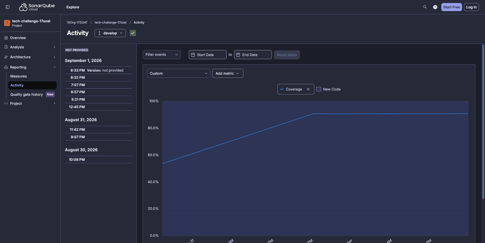
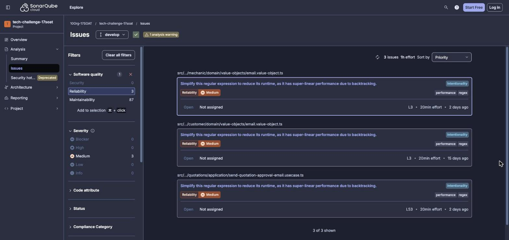
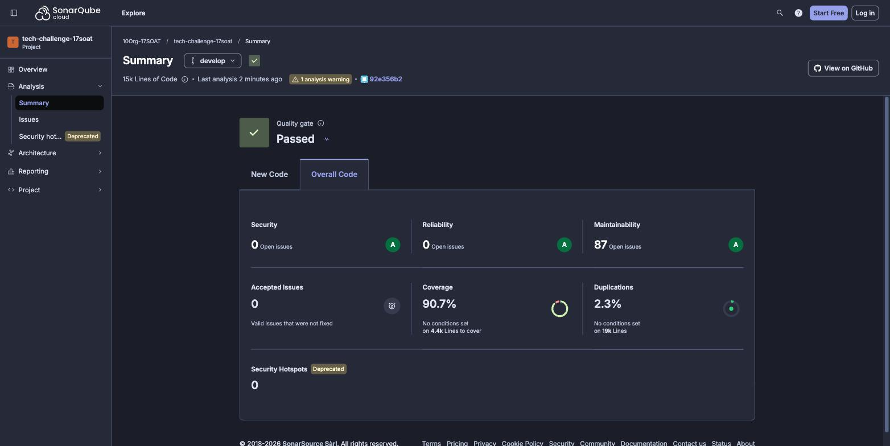

# Relatório de Análise de Vulnerabilidades

> **Projeto:** tech-challenge-17soat
> **Repositório:** <https://github.com/10Org-17SOAT/tech-challenge-17soat>
> **Ferramentas:** SonarCloud (SonarQube Cloud) — análise estática do código-fonte · `npm audit` — análise de dependências
> **Dashboard:** <https://sonarcloud.io/summary/overall?id=10Org-17SOAT_tech-challenge-17soat>
> **Análise inicial:** 30/08/2026, 22:08
> **Análise final:** 01/09/2026, 19:07
> **Fuso horário:** todos os horários deste relatório estão em America/São_Paulo (UTC−3)

---

## 1. Metodologia

A análise foi feita em duas frentes, porque elas cobrem superfícies diferentes e nenhuma
das duas sozinha cobre o projeto inteiro:

| Frente | Ferramenta | O que cobre |
| --- | --- | --- |
| Código-fonte próprio | **SonarCloud** | Issues de segurança, confiabilidade e manutenibilidade no código escrito pelo time |
| Cadeia de dependências | **`npm audit`** | Advisories em pacotes de terceiros — superfície que o SonarCloud **não** analisa |

### 1.1 SonarCloud

Executado pelo pipeline de CI (`.github/workflows/sonar.yml`) a cada push na `develop` e
em cada pull request. O job sobe um PostgreSQL 16 como *service container*, roda os
testes unitários com cobertura (`npm run test:cov`), aplica as migrações e roda os testes
end-to-end com cobertura (`npm run test:e2e:cov`), enviando código e os dois relatórios
LCOV ao SonarCloud (`sonarqube-scan-action@v6`). A configuração está em
`sonar-project.properties`.

> **Nota sobre o plano gratuito:** o SonarCloud free analisa apenas uma branch por
> projeto. A slot foi apontada para a `develop`, onde as features são integradas. A
> decoração de pull request é paga; a análise dos PRs roda como *check* de CI.

#### Uma armadilha na leitura das métricas

O SonarCloud convive hoje com duas taxonomias, e ler só uma delas leva a conclusão
errada. Este relatório usa as duas de propósito:

- **Legada:** classifica cada issue como `BUG`, `VULNERABILITY` ou `CODE_SMELL`. É o que
  a API expõe nas métricas `bugs`, `vulnerabilities` e `code_smells`.
- **Clean Code (atual):** classifica por *software quality* — Security, Reliability,
  Maintainability — com severidade própria. É o que o dashboard mostra.

O mapeamento não é um-para-um. Neste projeto, as métricas legadas retornam
`bugs: 0` e `code_smells: 90`, o que sugere "nada relevante além de manutenibilidade".
Mas o dashboard decompõe esses mesmos 90 em **87 de Maintainability e 3 de
Reliability** — e as 3 de Reliability são um problema de robustez concreto
(seção 2.2), não dívida cosmética. **Uma análise que tivesse parado na métrica legada
teria concluído que não havia nada a corrigir no código-fonte.**

### 1.2 `npm audit`

Executado contra o `package-lock.json`, comparando a árvore de dependências resolvida
(20 de produção, 26 de desenvolvimento, mais transitivas) com o GitHub Advisory Database.

### 1.3 Escopo da remediação

- Todas as issues de **Security** e todos os **security hotspots** do SonarCloud.
- Todas as issues de **Reliability** com impacto plausível em disponibilidade.
- Todas as vulnerabilidades de dependência **`high` ou `critical`**. Achados `moderate`
  sem correção upstream são analisados individualmente e têm o risco formalmente aceito
  e justificado (seção 5).
- Issues de **Maintainability** ficaram fora do escopo por não terem impacto de
  segurança.

---

## 2. Análise inicial (antes das correções)

### 2.0 Evolução no período



*Cobertura da `develop` ao longo das sete análises: 53,6% (30/08) → 90,7% (01/09).*

### 2.1 Panorama

Primeira análise da `develop` em **30/08/2026, 22:08**, com 7.839 linhas de código:

| Métrica | Valor |
| --- | --- |
| **Vulnerabilities** | **0** |
| **Security Hotspots** | **0** |
| **Security Rating** | **A** |
| Bugs (legado) | 0 |
| Reliability Rating | A |
| Code Smells (legado) | 44 |
| Coverage | 53,6% |
| Duplicated Lines | 1,0% |
| Quality Gate | OK |

Evolução ao longo das sete análises:

| Data e hora | ncloc | Vulnerabilities | Hotspots | Bugs | Coverage | Code Smells |
| --- | --- | --- | --- | --- | --- | --- |
| 30/08 22:08 | 7.839 | 0 | 0 | 0 | 53,6% | 44 |
| 31/08 21:07 | 12.182 | 0 | 0 | 0 | 90,7% | 69 |
| 31/08 23:42 | 14.802 | 0 | 0 | 0 | 90,5% | 94 |
| 01/09 12:45 | 14.905 | 0 | 0 | 0 | 90,6% | 94 |
| 01/09 17:21 | 15.174 | 0 | 0 | 0 | 90,6% | 90 |
| 01/09 18:57 | 15.343 | 0 | 0 | 0 | 90,7% | 90 |
| 01/09 19:07 | 15.343 | 0 | 0 | 0 | 90,7% | 90 |

**Nenhuma vulnerability e nenhum security hotspot** foram levantados em qualquer momento,
com a base praticamente dobrando de tamanho (7.839 → 15.343 ncloc).

### 2.2 Issues de Reliability — backtracking super-linear (ReDoS latente)

Três ocorrências da regra [`typescript:S8786`](https://rules.sonarsource.com/typescript/RSPEC-8786),
severidade **Medium**, *"Simplify this regular expression to reduce its runtime, as it has
super-linear performance due to backtracking"*:

| # | Arquivo | Linha | Expressão |
| --- | --- | --- | --- |
| 1 | `modules/onboarding/customer/domain/value-objects/email.value-object.ts` | 3 | `/^[^\s@]+@[^\s@]+\.[^\s@]+$/` |
| 2 | `modules/mechanic/domain/value-objects/email.value-object.ts` | 3 | mesma expressão |
| 3 | `modules/service-management/quotations/application/send-quotation-approval-email.usecase.ts` | 53 | `/\/+$/` |



*As três ocorrências no dashboard, antes da correção. Note o filtro lateral:
Security 0, Reliability 3, Maintainability 87.*

**Causa (itens 1 e 2).** Em `[^\s@]+\.[^\s@]+`, o caractere `.` também pertence à classe
`[^\s@]`. Rótulo do domínio e separador disputam os mesmos caracteres, então uma entrada
que **falha** a validação pode ser dividida de N formas diferentes, e o motor tenta
todas. O custo é quadrático no tamanho da entrada.

**Medição.** Com a entrada adversária `a@` + `b.`×n + espaço:

| Tamanho da entrada | Tempo de avaliação |
| --- | --- |
| 4 KB | 4,1 ms |
| 16 KB | 66,8 ms |
| 64 KB | 1.058 ms |
| 100 KB | 2.569 ms |

Quadruplicar a entrada multiplica o tempo por ~16 — assinatura de comportamento
quadrático.

#### Severidade real: latente, não explorável

A medição acima é da expressão **isolada**. Verificando o caminho real de uma
requisição, o risco não se concretiza:

- Os DTOs de request validam com `z.string().trim().email(...)`, e o `ZodValidationPipe`
  global roda **antes** de o value object ser construído.
- O payload adversário é **rejeitado pelo Zod em 0,1 ms** e nunca alcança a expressão
  vulnerável.
- Uma string que **passa** pelo Zod também casa com a expressão do value object sem
  backtracking (o custo alto só ocorre em entradas que falham).

Além disso, os endpoints afetados exigem chamador autenticado — `POST /customers` é
`ADMIN`; `POST /mechanics` é `ADMIN` ou `MECHANIC`.

O item 3 opera sobre `APP_BASE_URL`, lida do ambiente: **nunca foi controlável por
atacante**, embora também seja quadrática (3,4 s com 100 mil barras).

**Classificação adotada:** defeito **latente**, corrigido como **defesa em profundidade**
— não como vulnerabilidade explorável. A justificativa para corrigir mesmo assim é que
`Email` é um construtor público de domínio, e hoje ele está protegido apenas porque
*todo* caminho de entrada passa pelo Zod antes. Remover a dependência dessa coincidência
custa uma linha; garantir que ela continue verdadeira a cada nova rota custa muito mais.

### 2.3 Vulnerabilidades de dependência (`npm audit`)

| Severidade | Quantidade |
| --- | --- |
| Critical | 0 |
| **High** | **2** |
| **Moderate** | **4** |
| Low | 0 |
| **Total** | **6** |

| # | Pacote | Severidade | Advisory | Cadeia | Descrição |
| --- | --- | --- | --- | --- | --- |
| 1 | `js-yaml` 5.2.1 | **High** | [GHSA-pm4m-ph32-ghv5](https://github.com/advisories/GHSA-pm4m-ph32-ghv5) | direto | Tempo de parsing exponencial em *flow collections*: um YAML malicioso trava o processo |
| 2 | `@nestjs/swagger` 11.4.6 | **High** | herdado | `@nestjs/swagger → js-yaml` | Depende de versão vulnerável do `js-yaml` |
| 3 | `esbuild` | Moderate | [GHSA-67mh-4wv8-2f99](https://github.com/advisories/GHSA-67mh-4wv8-2f99) | direto | O dev server do esbuild aceita requisições de qualquer origem e devolve a resposta |
| 4 | `@esbuild-kit/core-utils` | Moderate | herdado | `→ esbuild` | Idem |
| 5 | `@esbuild-kit/esm-loader` | Moderate | herdado | `→ @esbuild-kit/core-utils` | Idem |
| 6 | `drizzle-kit` 0.31.10 | Moderate | herdado | `→ @esbuild-kit/esm-loader` | Idem |

São **dois problemas de raiz** — `js-yaml` (itens 1–2) e `esbuild` (itens 3–6) — cada um
contaminando a cadeia acima dele.

### 2.4 Security hotspots

Nenhum hotspot foi levantado em qualquer análise: a API retorna 0 tanto em `TO_REVIEW`
quanto em `REVIEWED`. Não há hotspot a revisar ou justificar.

---

## 3. Correções realizadas

### 3.1 Backtracking super-linear nas regex de validação

- **Itens:** #1, #2 e #3 (seção 2.2) · **Regra:** `typescript:S8786` · **Severidade:** Medium
- **Correção (itens 1 e 2):** excluir o `.` da classe de caracteres do rótulo, eliminando
  a ambiguidade:

  ```diff
  -const EMAIL_REGEX = /^[^\s@]+@[^\s@]+\.[^\s@]+$/;
  +const EMAIL_REGEX = /^[^\s@]+@[^\s@.]+(?:\.[^\s@.]+)+$/;
  ```

  Rótulo e separador deixam de disputar o mesmo caractere e o casamento passa a ser
  linear. **Ganho medido: 2.569 ms → 0,309 ms** numa entrada de 100 KB (~8.300×).
  Efeito colateral desejável: `a@b..com` era aceito pela expressão antiga e passa a ser
  rejeitado.
- **Correção (item 3):** `baseUrl.replace(/\/+$/, '')` substituído por uma função
  `stripTrailingSlashes` com laço, sem expressão regular.
- **Testes:** dois por value object — rejeição de rótulo vazio (`a@b..c`) e regressão de
  desempenho exigindo que 64 KB de entrada adversária sejam rejeitados em menos de
  100 ms (margem de 10× sobre os 1.058 ms da expressão antiga, para não ficar sensível à
  máquina do CI). Total de testes unitários: 629 → **633**.
- **Validação:** `npm run build` ✅ · `npm test` (103 suítes, 633 testes) ✅ ·
  `npm run test:e2e` (23 suítes, 302 testes) ✅
- **PR:** [#93 — `fix(security): elimina backtracking super-linear nas regex de validação`](https://github.com/10Org-17SOAT/tech-challenge-17soat/pull/93)

### 3.2 `js-yaml` — negação de serviço por parsing exponencial

- **Itens:** #1 e #2 (seção 2.3) · **Severidade:** High
- **Causa:** o `@nestjs/swagger`, usado para gerar o documento OpenAPI, dependia de
  `js-yaml` na faixa 5.0.0–5.2.1. Nessa faixa o parser tem complexidade exponencial em
  *flow collections* aninhadas: um YAML pequeno e propositalmente construído consome CPU
  indefinidamente e derruba o processo Node.
- **Correção:** `npm audit fix`, resolvendo para `js-yaml` 5.3.0 e `@nestjs/swagger`
  11.4.7. Alterou **apenas o `package-lock.json`** — o `package.json` não mudou e nenhuma
  dependência nova entrou.
- **Validação:** `npm run build` ✅ · `npm test` ✅ · `npm run test:e2e` ✅
- **PR:** [#92 — `fix(deps): corrige vulnerabilidades high de dependências`](https://github.com/10Org-17SOAT/tech-challenge-17soat/pull/92)

---

## 4. Correções não necessárias

Nenhuma issue de **Security** e nenhum **security hotspot** foi apontado pelo SonarCloud
em qualquer análise. As decisões que sustentam esse resultado estão na seção 2.1.

---

## 5. Riscos aceitos

### 5.1 Cadeia `esbuild` → `drizzle-kit`

- **Itens:** #3 a #6 (seção 2.3) · **Severidade:** Moderate (4 ocorrências, mesma raiz)
- **Advisory:** [GHSA-67mh-4wv8-2f99](https://github.com/advisories/GHSA-67mh-4wv8-2f99)
- **Decisão:** risco aceito, sem correção nesta entrega.

Justificativa:

1. **Não existe correção upstream.** O `drizzle-kit` já está na última versão publicada
   (0.31.10), e ela ainda depende da cadeia vulnerável. `npm audit fix --force` propõe
   instalar `drizzle-kit@0.18.1` — um downgrade que quebraria o setup de migrações.
   Trocar uma vulnerabilidade moderate de ambiente de desenvolvimento por um sistema de
   migrações quebrado é uma piora líquida.
2. **É `devDependency`.** Não entra no build de produção (`nest build` → `dist/`), então
   o código vulnerável nunca chega ao artefato publicado.
3. **O vetor não se materializa neste uso.** O advisory exige o dev server do esbuild
   rodando e alcançável. O `drizzle-kit` usa o esbuild apenas para transpilar
   `drizzle.config.ts` em linha de comando; nenhum servidor é iniciado.

**Plano de reavaliação:** acompanhar as releases do `drizzle-kit` e aplicar o bump assim
que a cadeia for atualizada. Como o `npm audit` não roda no CI hoje, é verificação
manual — automatizá-la é a recomendação 1 da seção 7.

---

## 6. Análise final (depois das correções)



*Análise da `develop` em 01/09/2026, 20:33 — após o merge dos PRs #92 e #93.*

### 6.1 SonarCloud

| Métrica | Antes (30/08) | Depois (01/09) | Resultado |
| --- | --- | --- | --- |
| **Security — issues** | 0 | 0 | mantido |
| **Security Hotspots** | 0 | 0 | mantido |
| **Security Rating** | A | A | mantido |
| **Reliability — issues** | **3** | **0** | **−3 (100% corrigidas)** |
| Reliability Rating | A | A | mantido |
| Maintainability — issues | 87 | 87 | fora do escopo |
| **Coverage** | 53,6% | **90,7%** | **+37,1 p.p.** |
| Duplicated Lines | 1,0% | **2,3%** | ↑ |
| Lines of Code | 7.839 | 15.336 | +96% |
| **Quality Gate** | OK | **OK** | mantido |

### 6.2 `npm audit`

| Severidade | Antes | Depois | Resultado |
| --- | --- | --- | --- |
| Critical | 0 | 0 | — |
| **High** | **2** | **0** | **−2 (100% corrigidas)** |
| Moderate | 4 | 4 | risco aceito (seção 5.1) |
| Low | 0 | 0 | — |
| **Total** | **6** | **4** | **−2** |

### Verificação

Resultado auditável de forma independente no dashboard público:
<https://sonarcloud.io/summary/overall?id=10Org-17SOAT_tech-challenge-17soat>
